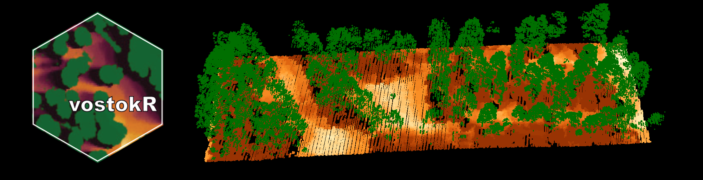
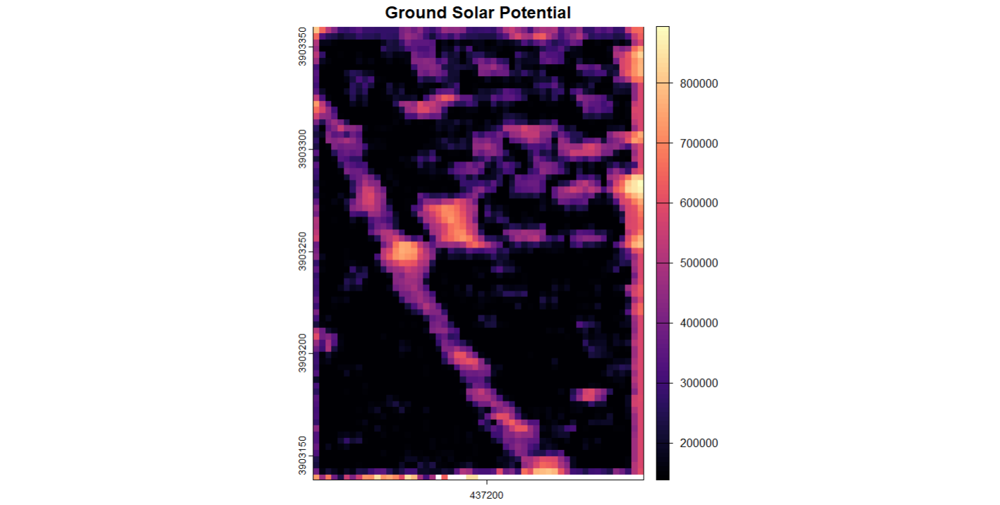

##vostokR: Solar Potential Calculation for LiDAR Point Clouds using VOSTOK

## Overview

vostokR provides an R interface to the VOSTOK (Voxel Octree Solar Toolkit) algorithm for calculating solar potential on LiDAR point clouds. This package uses the original C++ implementation by Bechtold and Höfle (2020) to perform efficient ray casting and solar position calculations, computing solar irradiance for each point while accounting for shadowing effects from surrounding points.

The package integrates seamlessly with the lidR ecosystem for LiDAR data processing and uses the SOLPOS library from the U.S. Department of Energy National Renewable Energy Laboratory for accurate solar position calculations.

## Authors and Attribution

**Primary Author**: Andrew Sánchez Meador (Northern Arizona University)\
**Original VOSTOK Implementation**: Sebastian Bechtold and Bernhard Höfle (2020)

This R package is based on the original VOSTOK toolkit developed by Bechtold and Höfle. The core C++ solar potential calculation algorithms remain unchanged from the original implementation.

## Citation

When using this package, please cite both the R package and the original VOSTOK toolkit:

``` bibtex
@manual{vostokR,
  title = {vostokR: Solar Potential Calculation for Point Clouds using VOSTOK},
  author = {Andrew {Sánchez Meador} and Sebastian Bechtold and Bernhard Höfle},
  year = {2025},
  note = {R package version 0.1.0},
  url = {https://github.com/bi0m3trics/vostokR}
}

@data{bechtold2020vostok,
  author = {Sebastian Bechtold and Bernhard Höfle},
  publisher = {heiDATA},
  title = {VOSTOK - The Voxel Octree Solar Toolkit},
  year = {2020},
  version = {V1},
  doi = {10.11588/data/QNA02B},
  url = {https://doi.org/10.11588/data/QNA02B}
}
```

## Important Note

The current version assumes clear sky conditions in the calculation of solar irradiance. Cloud coverage is not considered. To account for overcast conditions, you'll need to apply a correction to the modelled values using measurements from meteorological stations to derive the ratio between overcast and clear sky values for your specific location.

The Linke atmospheric turbidity coefficient, which models the atmospheric absorption and scattering of solar radiation under clear sky, is currently set to a fixed value of 3. This value is near the annual average for rural-city areas in Europe (i.e., mild climate in the Northern hemisphere). The factor should be adjusted for other study areas, see reference literature.

## Installation

``` r
# Install dependencies first
install.packages(c("Rcpp", "lidR", "data.table", "terra", "sf"))

# Install vostokR from GitHub
devtools::install_github("bi0m3trics/vostokR")
```

## Usage

Here's a basic example:

``` r
library(lidR)
library(vostokR)
library(terra)

# Load test data included with the package
LASfile <- system.file("extdata", "test.laz", package="vostokR") 
las <- readLAS(LASfile)

# Add normal vectors if not present
las <- add_normals(las, k = 10)

# Method 1: Auto-detect location from CRS with date range
las_solar <- calculate_solar_potential(las,
                                     year = 2025,
                                     start_date = "2025-06-01",  # Summer period
                                     end_date = "2025-08-31",
                                     day_step = 30,
                                     minute_step = 60,
                                     min_sun_angle = 5,
                                     voxel_size = 1)

# Method 2: Manual coordinates with day numbers  
las_solar <- calculate_solar_potential(las,
                                     year = 2025, 
                                     day_start = 150,   # Day of year
                                     day_end = 250,
                                     day_step = 30,
                                     minute_step = 60,
                                     min_sun_angle = 5,
                                     voxel_size = 1,
                                     lat = 35.27,      # Manual coordinates
                                     lon = -111.69,
                                     timezone = -7)

# Visualization options:

# 1. Plot solar potential on point cloud (lidR style)
plot(las_solar, color = "solar_potential", pal = heat.colors(100))

# 2. Create and plot ground raster using terra
ground_raster <- solar_ground_raster(las_solar, res = 1.0)
plot(ground_raster, main = "Ground Solar Potential")
```

## Key Features

-   **Automatic CRS detection**: Extracts latitude, longitude, and timezone from LAS coordinate system
-   **Flexible date input**: Use either date ranges ("2025-06-01" to "2025-08-31") or day numbers (1-365)
-   **lidR integration**: Seamless integration with lidR point cloud processing workflows\
-   **Modern spatial support**: Uses terra package for raster operations instead of deprecated raster
-   **Multiple visualization options**: Point cloud plots and ground raster maps
-   **Efficient C++ core**: Uses original VOSTOK C++ implementation for fast shadow calculations
-   **OpenMP parallelization**: Multi-threaded processing for better performance

## Parameters

### Core Parameters

-   `year`: Year for calculation (default: 2025)
-   `start_date`/`end_date`: Date range as strings (e.g., "2025-06-01", "2025-08-31")
-   `day_start`/`day_end`: Alternative day-of-year numbers (1-365)
-   `day_step`: Interval between days (default: 30)
-   `minute_step`: Time interval in minutes within each day (default: 30)
-   `min_sun_angle`: Minimum sun elevation angle in degrees (default: 5)
-   `voxel_size`: Voxel size for octree shadow calculation (default: 1)

### Location Parameters (auto-detected if not provided)

-   `lat`: Latitude of study area (auto-detected from CRS)
-   `lon`: Longitude of study area (auto-detected from CRS)\
-   `timezone`: Time zone offset from UTC (auto-detected from CRS)

## Functions

-   `calculate_solar_potential()`: Main solar potential calculation with S3 methods for LAS and LAScatalog
-   `add_normals()`: Calculate surface normal vectors using k-nearest neighbors
-   `solar_ground_raster()`: Extract ground points and convert to terra SpatRaster\
-   `plot_solar_potential()`: Visualize solar potential directly on point cloud

## Example Output

The output point cloud contains the original coordinates, normal vectors (nx, ny, nz), and a new `solar_potential` column with values in kWh/m²/year. Ground rasters show spatial patterns of solar potential across the landscape.

 

## Implementation Details

The solar potential calculation uses the original VOSTOK algorithm:

1.  Computing sun positions throughout the day using the SOLPOS algorithm
2.  Ray casting through an octree structure to determine shadowing
3.  Calculating direct and diffuse radiation components
4.  Accounting for surface orientation using normal vectors

The minimum sun angle parameter can be useful for forest plots or other cases where the shadow point cloud extent is limited. It prevents unrealistic illumination from very low sun angles that would normally be blocked by surrounding terrain not included in the point cloud.

The tool will first provide some vostokmeta information and then run the solar potential calculation. On your screen, something like the following messages should appear:

```         
Auto-detected from CRS: lat=35.2704, lon=-111.6905, timezone=-7
Date range 2025-06-01 to 2025-08-31 converted to days 152-243
Point cloud size:            159.824 x 218.803 x 39.338
Required octree volume size: 256
Required octree depth:       8

Building octree... finished.
```

## Acknowledgments

This package is based on VOSTOK (Voxel Octree Solar Toolkit) developed by:

3DGeo Research Group\
Institute of Geography\
Heidelberg University\
<http://www.uni-heidelberg.de/3dgeo>

When using this package, please cite the original VOSTOK work:

Sánchez Meador, A., Bechtold, S. & Höfle, B. (2025): vostokR – Solar Potential Calculation for Point Clouds in R using VOSTOK. R package version 0.1.0. URL: <https://github.com/bi0m3trics/vostokR>

Bechtold, S. & Höfle, B. (2020): VOSTOK - The Voxel Octree Solar Toolkit. heiDATA, V1. DOI: [10.11588/data/QNA02B](https://doi.org/10.11588/data/QNA02B).

## License

This package is licensed under the GPL (\>= 2) license.
